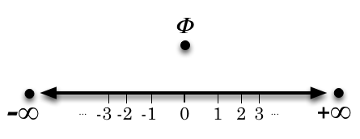

An Introduction to Transreal Numbers
====================================

The line, shown above is the real number-line, which contains all
of the *finite numbers*. The big dots ⬤ show the *non-finite numbers*. 
The extended-real number-line is the real number-line with
infinity (∞) and minus infinity (-∞). Every number to the right
of zero, on the extended-real number-line, is *positive*; every
number to the left of zero, on the extended-real number-line, is
*negative*. Zero is neither positive nor negative. The sign of zero
is zero. This definition, which is widely accepted in the world,
contradicts the teaching of sign in French speaking primary and
secondary schools, where it is taught that zero is a positive
number.

The *transreal number-line* is the extended-real numberline with nullity. 
Nullity (𝜱) lies off the extended-real number-line [#nullity]_.
Nullity is neither positive nor negative. The sign of nullity is nullity. 
Infinity (∞) is the most
positive number and minus infinity (-∞) is the most negative
number. Infinity is bigger, meaning further to the right on the extended
real number-line, than any number apart from itself and nullity. 
Minus infinity is smaller, meaning further to the left on the extended-real
number-line, than any number apart from itself and nullity. 
Nullity is equal to itself but is not bigger than or smaller than any
number! This is because it is not on the extended-real number line.

This paints a mental picture of how the transreal numbers relate
to each other and gives a vocabulary for talking about these relationships. 
Both aspects are extended in more advanced study.

The standard form of certain numbers is as follows. 
Transreal one (1) is real one divided by real one: :math:`\frac{1}{1}`. 
Transreal minus-one (-1) is real minus-one divided by real one: :math:`\frac{-1}{1}`. 
Transreal zero (0) is real zero divided by real one: :math:`\frac{0}{1}`. 
Transreal infinity (∞) is real one divided by real zero: :math:`\frac{1}{0}`.
Transreal minus-infinity (-∞) is real minus-one divided by real zero: :math:`\frac{-1}{0}`. 
Transreal nullity (𝜱) is real zero divided by real zero: :math:`\frac{0}{0}`. 
Any irrational number :math:`x` is :math:`x` divided by real one: :math:`\frac{x}{1}`.

*Transreal numbers* can be expressed as *transreal fractions* :math:`\frac{n}{d}`
of a real *numerator* :math:`n` and a non-negative, real *denominator* :math:`d`. 
Transreal numbers with a non-finite numerator or denominator simplify to this 
form. An *improper fraction* can be written with a negative denominator, but it 
must be converted to a *proper fraction*, by carrying the sign up to the 
numerator, before applying any transreal, arithmetical operation. This can be
done by multiplying both the numerator and denominator by minus one; it can be 
done by negating both the numerator and the denominator, using subtraction; 
and it can be done, lexically, by moving the minus sign from the denominator to 
the numerator.

.. math:: 
	:label: proper

	\frac{n}{-d} = \frac{-1 \times n}{-1 \times (-d)} = \frac{-n}{-(-d)} = \frac{-n}{d}

Transreal infinity is equal to any positive number divided by
zero. Transreal minus-infinity is equal to any negative number
divided by zero. Zero is equal to zero divided by any positive or
negative number. That is, with :math:`k > 0` we have:

.. math::
	:label: withk

	\infty = \frac{1}{0} = \frac{k}{0}

	-\infty = \frac{-1}{0} = \frac{-k}{0}

	0 = \frac{0}{1} = \frac{0}{k} = \frac{0}{-k}

The ordinary rules for multiplication and division apply universally to 
proper transreal-fractions. That is, they apply without
side conditions. In particular, division by zero is allowed.

.. math:: 
	:label: rules

	\frac{a}{b} \times \frac{c}{d} = \frac{a \times c }{b \times d}

	\frac{a}{b} \div \frac{c}{d} = \frac{a}{b} \times \frac{d}{c}

Addition is more difficult than multiplication and division
because it breaks into two cases: the addition of two signed infinities 
and the general case. 

The general rule of addition looks like this.

.. math:: \frac{a}{b} + \frac{c}{d} = \frac{a \times d + b \times c}{b \times d}
	:label: addition

However, two infinities are added using the 
rule for adding fractions with a common denominator [#reason]_.
The sign of each infinity, :math:`\pm \infty`, may be chosen independently but
the chosen sign is then carried into the corresponding term 
:math:`\pm 1` so that 
:math:`+ \infty` has :math:`+1` and 
:math:`- \infty` has :math:`-1`:

.. math:: \pm \infty + \pm \infty = \frac{\pm 1}{0} + \frac{\pm 1}{0} = \frac{(\pm 1) + (\pm 1)}{0}
	:label: additioninf

Subtraction is the addition of a negated number:

.. math:: \frac{a}{b} - \frac{c}{d} = \frac{a}{b} + \frac{-c}{d}
	:label: subtraction

Transreal arithmetic is totally associative and totally commutative but it is only 
partially distributive at infinity. The axiom of transreal distributivity
[P8]_
can be broken down into a number of cases. As usual, a number :math:`a` 
distributes over :math:`b + c` only when:

.. math:: a \times ( b + c ) = a \times b + a \times c
	:label: distributivity

If :math:`a` is finite or nullity then :math:`a` distributes over any :math:`b + c`. 
If
:math:`a` is infinity or minus infinity then :math:`a` distributes if 
:math:`b + c = \Phi` or :math:`b + c = 0` or :math:`b` and :math:`c` have the same sign [#sign]_. 

----------------

.. [#nullity] At distance and angle nullity. 

.. [#reason] If infinities were
	added by the general rule we would have :math:`\infty + \infty = \Phi`, but this
	is inconsistent with various arithmetics ([A1]_, [A2]_, [A3]_) 
	of the infinite that all have :math:`\infty + \infty = \infty`. 

.. [#sign] Two numbers
	have the same sign if they are both positive, both negative, both
	zero or both nullity.

